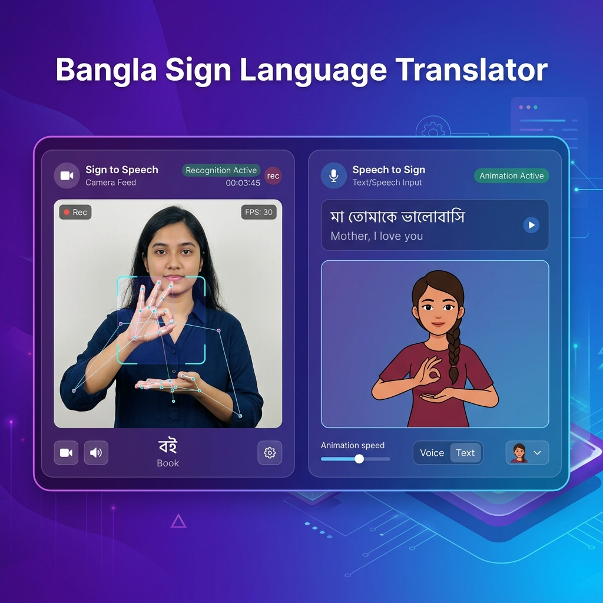

<p align="center">
  
</p>

<h1 align="center">🤟 Bidirectional Bangla Sign Language Translator</h1>

<p align="center">
  <strong>Real-time Sign Language ↔ Speech translation running entirely in the browser</strong>
</p>

<p align="center">
  
  
  
  
  
  
</p>

---

## 📖 Overview

A **bidirectional** web application that translates between **Bangla Sign Language** and **spoken Bengali**, running entirely client-side in the browser with no backend server required.

| Direction | Input | Output | Technology |
|-----------|-------|--------|------------|
| **Sign → Speech** | Camera (hand gestures) | Detected Bengali word + sentence | MediaPipe Landmarks + Custom MLP Neural Network |
| **Speech → Sign** | Voice / text input | Avatar animation sequence | Web Speech API + Word-to-Avatar mapping |

The app only ever translates **Bangla Sign Language**. The surrounding interface can be switched between Bengali and English.

### ✨ Key Features

- 🖐️ **Real-time gesture recognition** — 60 Bangla sign gestures detected via webcam
- 🗣️ **Voice input** — Speak in Bengali, see avatar sign animations
- ⌨️ **Text input** — Type Bengali text, get sign language translation
- 🧠 **Smart word matching** — 378 searchable words map onto 66 signs, handling verb conjugations, synonyms and case suffixes
- 🌐 **Bengali / English interface** — switchable at runtime, including Bengali numerals
- 💾 **Settings persist** — every toggle is saved to `localStorage`
- 📴 **Installable PWA** — service worker precaches the app shell for offline use
- ⚡ **No backend needed** — pure JavaScript inference, static hosting only
- 🎯 **Primary person detection** — filters out bystanders' hands using pose-wrist proximity

---

## 🏗️ Architecture

```
┌───────────────────────────────────────────────────────────┐
│                    Browser (Client-Side)                   │
├─────────────────────────┬─────────────────────────────────┤
│   Sign → Speech         │       Speech → Sign             │
│                         │                                 │
│  Camera Feed            │  Voice Input (Web Speech API)   │
│       ↓                 │  Text Input                     │
│  MediaPipe Hands+Pose   │       ↓                         │
│       ↓                 │  Smart Bangla Tokenizer         │
│  154 Keypoints          │       ↓                         │
│       ↓                 │  data/signs.json lookup         │
│  StandardScaler         │  (66 signs, 312 variants)       │
│       ↓                 │       ↓                         │
│  MLP Neural Network     │  Sequential Animation           │
│  (154→256→128→64→60)    │                                 │
│       ↓                 │                                 │
│  Predicted Gesture ──── data/signs.json ──→ Avatar Display │
└─────────────────────────┴─────────────────────────────────┘
```

### Single source of truth

`data/signs.json` is the one place vocabulary lives. Each entry carries its slug, Bengali and
English names, model class index, avatar file, and every inflection that should resolve to it.
Both translation directions, the dictionary page and the audio playback all read from it.

`data/class_labels.json` stays frozen and separate: its index order is a contract with the trained
model weights, so `signs.json` references it via `classIndex` and never the other way round.
`tools/verify.py` asserts the two never drift apart.

All avatar and audio files use lowercase ASCII slugs (`my.webp`, `shut-up_bn.mp3`). This is
deliberate — filenames containing capitals, spaces or Bengali characters resolve fine on macOS but
404 on a case-sensitive Linux host such as Netlify.

---

## 📁 Project Structure

```
├── index.html              # Main app shell
├── dictionary.html         # Sign dictionary, rendered from data/signs.json
├── manifest.json           # PWA manifest
├── sw.js                   # Service worker (app-shell precache, network-first)
├── netlify.toml            # Cache headers for deployment
├── css/
│   └── style.css           # Styling, glassmorphism, skeletons, tooltips
├── js/
│   ├── config.js           # Shared configuration & settings defaults
│   ├── i18n.js             # Bengali/English interface strings
│   ├── utils.js            # Keypoint extraction, normalization, audio playback
│   ├── sign-data.js        # Loads signs.json, resolves words → signs
│   ├── settings.js         # Declarative toggles, persisted to localStorage
│   ├── sign-to-speech.js   # Gesture recognition (camera → prediction)
│   ├── speech-to-sign.js   # Voice/text → avatar animation
│   └── app.js              # Boot sequence, permissions, status bar
├── models/
│   └── model_weights.json  # Extracted MLP weights
├── data/
│   ├── signs.json          # ← single source of truth for vocabulary
│   ├── class_labels.json   # 60 model class labels (frozen, index order matters)
│   └── scaler.json         # StandardScaler parameters
├── avatars/                # 67 .webp — 50 rendered avatars, 16 reference photos, 1 neutral
├── audio/                  # 120 .mp3 — 60 words × Bengali/English
├── tools/
│   ├── verify.py           # Integrity check — run after any vocabulary change
│   ├── build_signs.py      # One-off generator for signs.json
│   └── migrate_assets.py   # One-off asset rename to ASCII slugs
├── serve.py                # Local development server
└── readme.md
```

---

## 🚀 Quick Start

```bash
git clone https://github.com/Shahriar290900/Bidirectional-Sign-Language-Translator.git
cd Bidirectional-Sign-Language-Translator
python3 serve.py
```

Then open **http://localhost:8000** in Chrome.

> **Why a server?** The Web Speech API (voice input) requires a secure context (`https://` or
> `localhost`). Opening `index.html` directly via `file://` breaks both voice input and the
> `fetch` calls that load the vocabulary.

---

## 🎮 How to Use

### Sign → Speech (Camera)
1. Tap **Camera**, then **Start Camera**, and allow camera permission
2. Show Bangla sign language gestures to the webcam
3. Hold a gesture steady for ~1 second — it gets added to the sentence
4. The detected word is spoken aloud if Voice Output is on

### Speech → Sign (Voice)
1. Tap **Voice**, then either speak in Bengali or type Bengali text
2. Tap **Translate**
3. Avatars play in sequence for each recognised word
4. Words with no avatar fall back to large text or a neutral pose (configurable)

### ⚙️ Settings

| Setting | Effect |
|---------|--------|
| **Interface Language** | Switches all interface text between Bengali and English |
| **Text Size** | Scales the whole app between 14px and 16px root size |
| **Camera / Microphone Permission** | Requests browser access and reflects the real granted state |
| **Camera View** | Landscape (640×480) or Portrait (480×640) |
| **Missing Avatar** | Show the word as text, or show a neutral pose |
| **Voice Output** | Speak detected words aloud |
| **Voice Language** | Which pre-recorded audio plays — Bengali or English |

All settings persist across reloads.

> Browsers cannot revoke a granted camera or microphone permission from a page, so those two
> toggles reflect the real permission state and point you at browser settings instead of
> pretending to turn access off.

---

## 🧠 Model Details

| Property | Value |
|----------|-------|
| **Model Type** | Multi-Layer Perceptron (MLP) |
| **Architecture** | 154 → 256 → 128 → 64 → 60 |
| **Input Features** | 126 (hand landmarks) + 27 (pose landmarks) + 1 (pose flag) = 154 |
| **Output Classes** | 60 Bangla sign gestures |
| **Accuracy** | ~92% |
| **Inference** | Pure JavaScript (no TensorFlow.js needed) |
| **Landmark Detection** | MediaPipe Hands + Pose (via CDN) |

### Feature Extraction Pipeline
1. **MediaPipe** detects hand landmarks (21×3×2 hands) and pose landmarks (9 upper body points × 3)
2. Hands are **sorted by handedness** (Left first, Right second)
3. **Primary person filtering** discards hands not belonging to the nearest person
4. Landmarks are **centered** on nose (if pose detected) or wrist, and **scaled** by shoulder distance or hand size
5. **StandardScaler** normalizes features using pre-computed mean and variance
6. **MLP inference** runs through 4 dense layers with ReLU + Softmax

---

## 🖼️ About the avatar set

The camera recognises 60 words. Of those, 50 have a rendered 3D avatar; the remaining 16 are
illustrated with a still photograph from the training dataset and are marked **Reference photo**
in the dictionary and during playback.

Bangla Sign Language has no grammatical inflection, so words that share one physical sign share one
avatar — `আমি` and `আমার` both display the same image, as do `তুমি` and `তোমার`.

---

## 🔍 Verifying a vocabulary change

After editing `data/signs.json` or adding assets:

```bash
python3 tools/verify.py
```

It checks that every referenced avatar and audio file exists byte-exactly, that filenames stay
lowercase ASCII and NFC-normalised, that `classIndex` values still match `class_labels.json`, and
that no word is claimed by two signs. macOS resolves paths case- and normalization-insensitively,
so this script is what catches problems that would only appear once deployed.

---

## 🌐 Browser Compatibility

| Browser | Sign → Speech | Speech → Sign (Voice) | Speech → Sign (Text) |
|---------|:---:|:---:|:---:|
| Chrome | ✅ | ✅ | ✅ |
| Edge | ✅ | ✅ (uses bn-IN) | ✅ |
| Firefox | ✅ | ❌ (no Speech API) | ✅ |
| Safari | ✅ | ⚠️ (partial) | ✅ |

> **Note:** For the smoothest performance and best voice recognition support, **Google Chrome** is highly recommended.

---

## 🛠️ Technology Stack

- **Frontend:** HTML5, CSS3, Vanilla JavaScript — no build step, no dependencies
- **ML Inference:** Pure JavaScript MLP engine
- **Hand/Pose Detection:** [MediaPipe Tasks Vision](https://developers.google.com/mediapipe) (v0.10.14)
- **Voice Recognition:** Web Speech API (browser-native)
- **Design:** Responsive CSS Grid, Glassmorphism, Outfit font
- **Deployment:** Netlify (static hosting)

---

## 📜 License

No LICENSE. Just Use, Find Issues, Help Us Improve The Model.

---

<p align="center">
  Made with ❤️ for Bangla Sign Language accessibility
</p>
