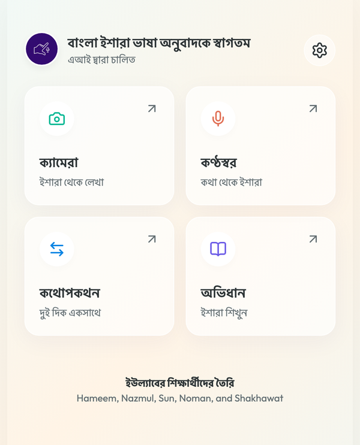
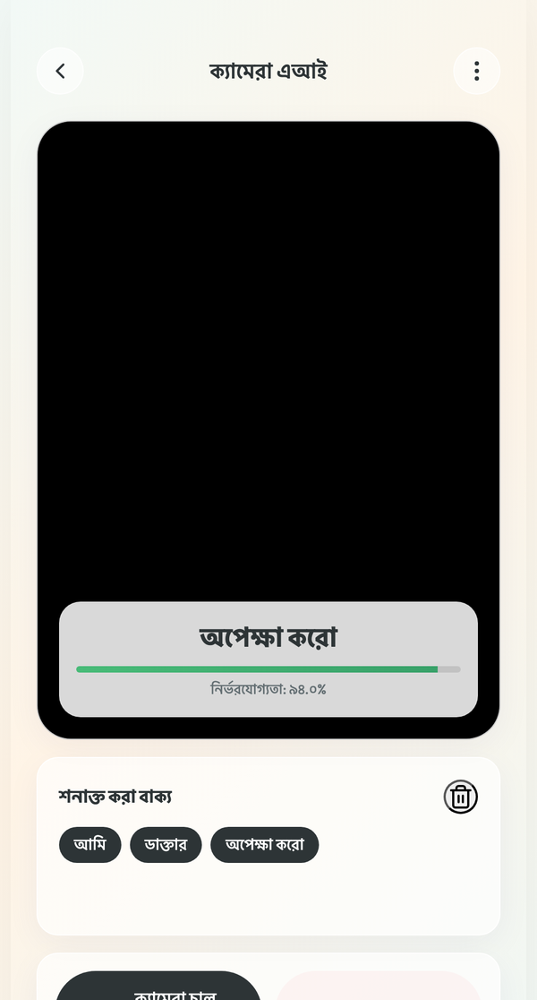
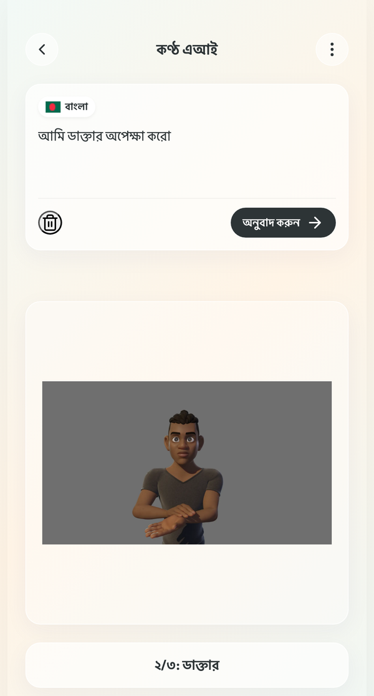
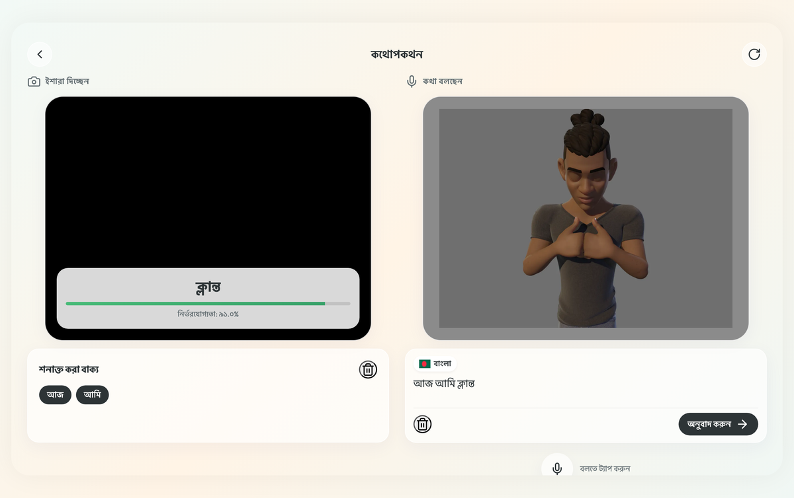
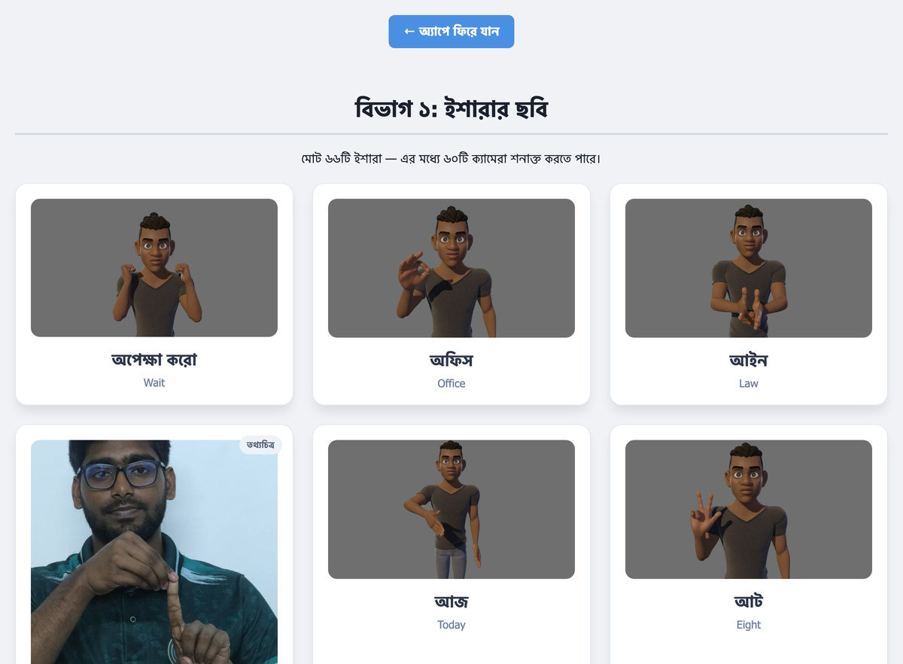
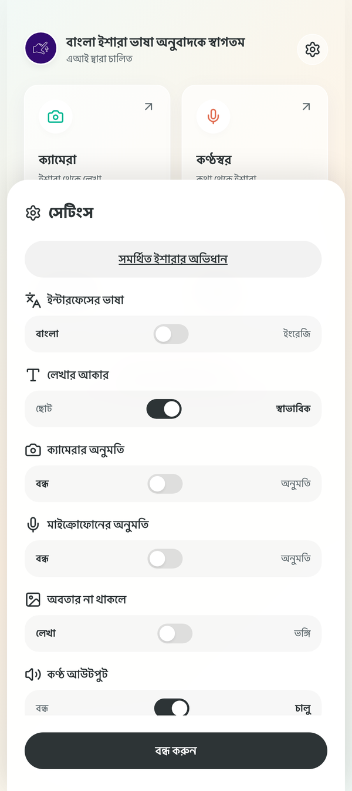
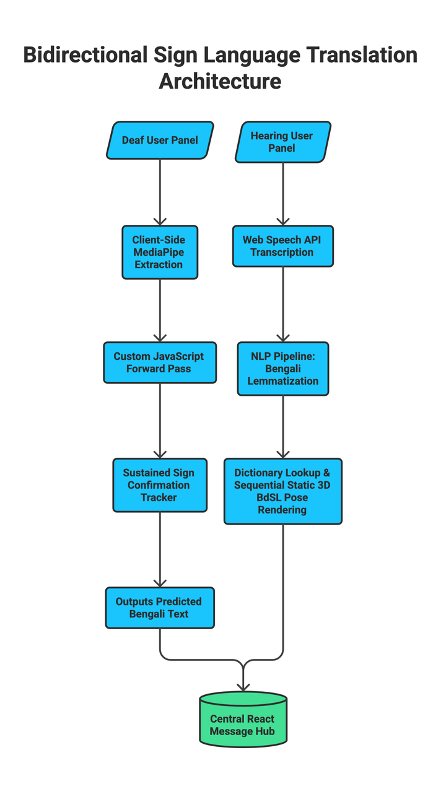
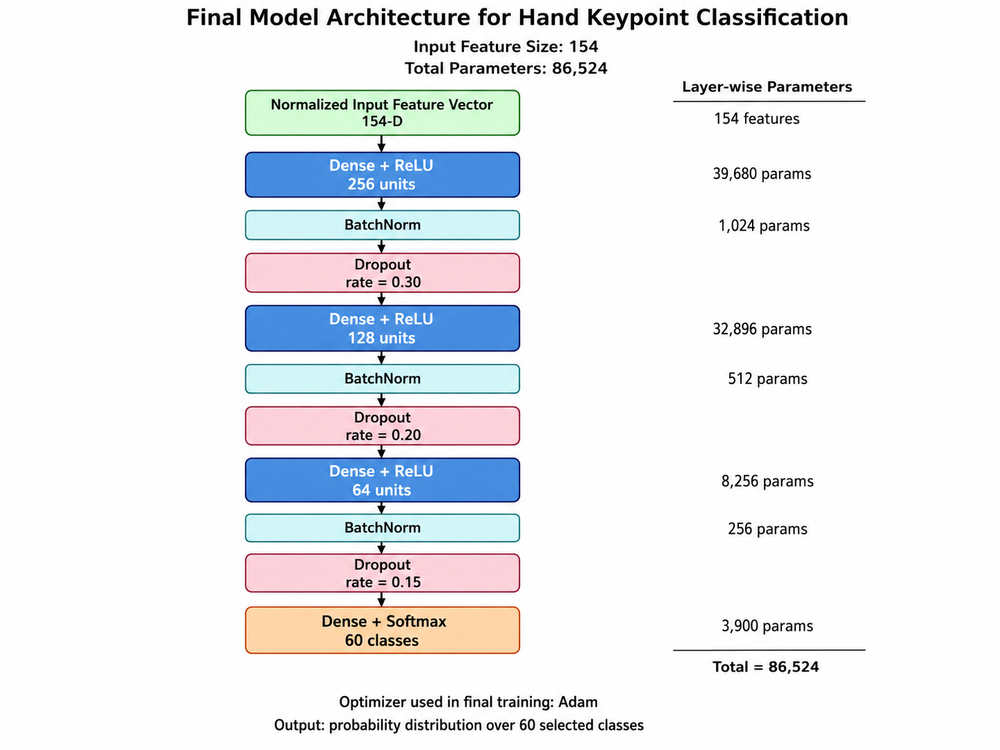
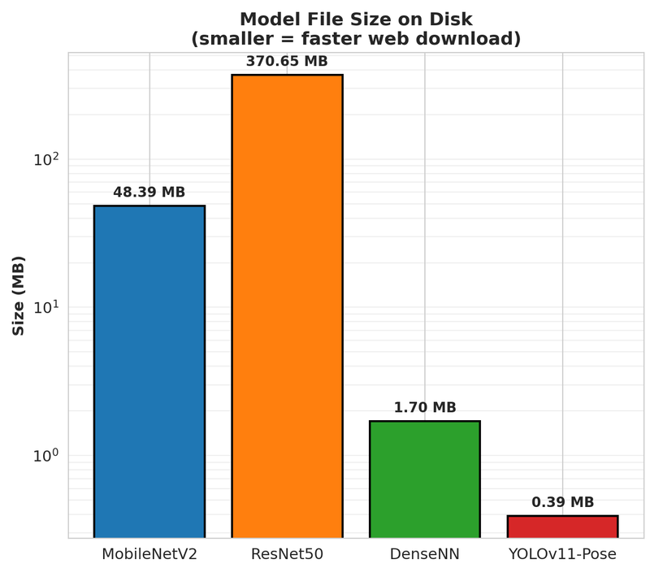

<p align="center">
  
</p>

<p align="center">
  <a href="https://shahriar290900.github.io/Bidirectional-Sign-Language-Translator/"><b>Open the live app</b></a>
  &nbsp;·&nbsp;
  <a href="#getting-started">Run it locally</a>
  &nbsp;·&nbsp;
  <a href="#how-to-use-it">How to use it</a>
  &nbsp;·&nbsp;
  <a href="#how-it-works">How it works</a>
</p>

---

## What this is

A web app that translates between **Bangla Sign Language (BdSL)** and **Bengali**, in both
directions, entirely inside the browser. There is nothing to install, no account, no server, and
no special hardware — a phone with a camera and a modern browser is enough.

| Direction | You do this | The app shows this |
|---|---|---|
| **Sign to text** | Sign at the camera | The Bengali word, and a sentence as it builds up |
| **Speech to sign** | Speak or type Bengali | A 3D avatar performing each sign in turn |
| **Conversation** | Both at the same time | Camera on one side, avatar on the other |

The app only ever translates Bangla Sign Language. The **interface text** can be switched between
Bengali and English, so a non-Bengali reader can still navigate it.

---

## Screenshots

<table>
<tr>
<td width="33%"></td>
<td width="33%"></td>
<td width="33%"></td>
</tr>
<tr>
<td align="center"><b>Home</b><br>Four modes, Bengali interface</td>
<td align="center"><b>Camera</b><br>Detected word, confidence, sentence</td>
<td align="center"><b>Voice</b><br>Each word played as a sign</td>
</tr>
</table>

**Conversation** puts both directions on screen at once, so a deaf and a hearing person can talk
without passing a phone back and forth.

<p align="center">
  
</p>

The built-in dictionary lists every sign the app knows, so it doubles as a learning aid.

<p align="center">
  
</p>

---

## Getting started

The app is a plain static site. There is no build step and no dependencies to install.

### Use the hosted version

Open **https://shahriar290900.github.io/Bidirectional-Sign-Language-Translator/** in Chrome or
Brave. Allow camera access when asked.

### Run it on your own machine

```bash
git clone https://github.com/Shahriar290900/Bidirectional-Sign-Language-Translator.git
cd Bidirectional-Sign-Language-Translator
python3 serve.py
```

That starts a local server and opens `http://localhost:8000` in your browser.

> **Why not just double-click index.html?**
> Opening the file directly gives it a `file://` address. Browsers block microphone access and
> block the `fetch` calls that load the vocabulary from that address, so voice input and the sign
> lookup both fail. The app needs `localhost` or `https://`, which is what `serve.py` provides.

---

## How to use it

### Camera — turning signs into Bengali

1. Open **Camera** and press **Start Camera**. Allow access when the browser asks.
2. Sign in front of the camera. The word the model currently sees appears over the video, with a
   confidence bar underneath it.
3. **Hold a sign still for about one second.** Only then is it added to the sentence. This is
   deliberate: it stops the sentence filling up with half-formed shapes while your hands move
   between signs.
4. The finished word is also spoken aloud, unless you turn Voice Output off.

### Voice — turning Bengali into signs

1. Open **Voice**. Either type Bengali in the box, or press the microphone and speak.
2. Press **Translate**.
3. The avatar performs one sign per word, in order, with a counter showing progress.
4. A word the app does not know is shown as large text instead of a wrong sign.

### Conversation — both at once

Open **Conversation**. The camera starts by itself, with the signing side on the left and the
speaking side on the right. On a phone the two stack; on a laptop they sit side by side.

The button in the top right rotates the speaking half by 180 degrees, so a tablet can lie flat on
a table between two people facing each other.

> While a sign is being spoken aloud, listening pauses automatically and resumes when the clip
> ends. Without that, the microphone would hear the app's own voice and transcribe it as input.

### Dictionary

Every sign the app knows, with its Bengali and English name. Signs illustrated by a photograph
from the training data rather than a rendered avatar are marked **Reference photo**.

---

## The interface

Every control has a **tooltip** explaining what it does — hover over any icon button on a desktop
browser and a short label appears. The same text is attached as an accessible name, so screen
readers announce it too. Tooltips are hidden on touch devices, where there is no hover.

All settings are saved in your browser and restored the next time you open the app.

<table>
<tr>
<td width="38%"></td>
<td valign="top">

| Setting | What it does |
|---|---|
| **Interface Language** | Switches all interface text between Bengali and English. Numbers switch too, so you see ৯৪ rather than 94. |
| **Text Size** | Scales the whole app between a small and a normal size. |
| **Camera Permission** | Asks the browser for camera access and shows whether it has been granted. |
| **Microphone Permission** | The same, for the microphone. |
| **Missing Avatar** | Chooses what to show for a word with no sign: the word in large text, or a neutral pose. |
| **Voice Output** | Whether detected words are spoken aloud. |

</td>
</tr>
</table>

> A browser will not let a page take back a permission once you have granted it. The two
> permission rows therefore report the real state and point you at your browser settings, rather
> than pretending to switch access off.

---

## How it works

Both directions read the same vocabulary file, `data/signs.json`, so the camera and the avatar can
never disagree about what a word means.

<p align="center">
  
</p>

### Sign to text

1. **MediaPipe** finds 21 landmarks on each hand and 9 upper-body pose points in every camera frame.
2. Those become **154 numbers**: 126 for the hands (21 points, 3 axes, 2 hands), 27 for the pose,
   and 1 flag recording whether a body pose was found at all.
3. The numbers are centred on the nose and scaled by shoulder width, so the same sign reads the
   same whether you are close to the camera or far from it.
4. A small neural network turns those 154 numbers into one of 60 words.

Nothing about the picture itself is used — only the geometry. That is why the model copes with a
different room, different lighting or a different shirt: those change the pixels but not the shape
your hands are making.

<p align="center">
  
</p>

### Speech to sign

Bengali speech is transcribed by the browser's own speech recognition, then each word is looked up
in `data/signs.json`. The lookup is more forgiving than an exact match:

- **378 word forms** — inflections, synonyms and spelling variants — resolve onto **66 signs**.
- Unknown words have common suffixes stripped, so `অফিসে` still finds `অফিস`.
- Multi-word signs are matched first, so `দাঁত মাজা` ("brush teeth") is never split into two
  unrelated signs.

Bangla Sign Language has no grammatical inflection, so words that share one physical sign share one
avatar: `আমি` and `আমার` are the same sign, as are `তুমি` and `তোমার`.

### The avatar set

Each sign was posed on a rigged 3D character in Blender and exported as a single high-resolution
frame — one pose per word. Static frames avoid the cost of running a live 3D avatar, which keeps
playback instant on a low-end phone. Of the 60 words the camera recognises, 50 have a rendered
avatar; the remaining 16 are illustrated with a still from the training data and are labelled as
such.

---

## Results

Four models were trained and then tested on **60 unseen reference signs**, each expanded into 10
augmented variants — 600 samples captured outside the training distribution, which is a much
harder test than a held-out split from the same recordings.

| Model | Top-1 accuracy | Browser latency | Size on disk | Parameters |
|---|---|---|---|---|
| **DenseNN (this project)** | **68.00%** | 234 ms | 1.70 MB | 86,524 |
| MobileNetV2 | 42.00% | 400 ms | 48.4 MB | 3,089,404 |
| ResNet50 | 41.17% | 1,220 ms | 370.7 MB | 24,704,003 |
| YOLOv11-Pose | 27.17% | 283 ms | 0.39 MB | 96,485 |

The keypoint model is more accurate than any of the image models here while being small enough to
download over a slow connection.

<p align="center">
  
</p>

Across ten augmentation conditions — brightness, contrast, blur, rotation, translation and noise —
the keypoint model held between 58% and 75%, while every pixel-based model stayed between 23% and 48%.

---

## Project structure

```
index.html              Main app
dictionary.html         Sign dictionary, built from data/signs.json
serve.py                Local development server
sw.js                   Service worker, for offline use
css/style.css           All styling
js/
  config.js             Settings and file paths
  i18n.js               Bengali and English interface text
  sign-data.js          Loads signs.json, resolves a word to a sign
  utils.js              Landmark maths and audio playback
  settings.js           Settings, saved to the browser
  sign-to-speech.js     Camera direction
  speech-to-sign.js     Voice direction
  app.js                Startup, view switching, permissions
data/
  signs.json            The vocabulary. Edit this to change what the app knows
  class_labels.json     The 60 model classes. Order is fixed by the trained weights
  scaler.json           Feature normalisation values
models/model_weights.json
avatars/                67 sign images
audio/                  120 recordings, Bengali and English
tools/                  Verification and generation scripts
```

### Changing the vocabulary

`data/signs.json` is the only file to edit. After changing it, run:

```bash
python3 tools/verify.py
```

It checks that every sign points at a file that exists, that filenames stay lowercase ASCII, and
that the class numbers still line up with the trained model. This matters more than it sounds:
macOS treats `My.webp` and `my.webp` as the same file, but the Linux server the app is hosted on
does not, so a mistake can work perfectly on your laptop and fail for everyone else.

---

## Browser support

| Browser | Camera to text | Voice input | Typing input |
|---|---|---|---|
| Chrome | Yes | Yes | Yes |
| Brave | Yes | Yes | Yes |
| Edge | Yes | Yes | Yes |
| Firefox | Yes | No speech recognition | Yes |
| Safari | Yes | Partial | Yes |

**Chrome or Brave is recommended.** Firefox has no Web Speech API, so voice input is unavailable
there — typing still works.

---

## Limitations

- The evaluation set was recorded with a **single signer in one indoor setting**. Accuracy with
  other signers, other lighting or other camera angles is unmeasured.
- Signs are classified from **single frames**, so signs defined by movement rather than by hand
  shape are not distinguished. Adding temporal modelling is the clearest next step.
- The vocabulary is **60 words**, which is enough for short practical exchanges, not conversation.

---

## Credits

Built by **Hameem, Nazmul, Sun, Noman and Shakhawat** at the University of Liberal Arts Bangladesh.
Supervised by **Nasir Uddin Ahmed**.

Sign recognition uses [MediaPipe Tasks Vision](https://developers.google.com/mediapipe).

## License

No licence. Use it, find problems, help us improve the model.
